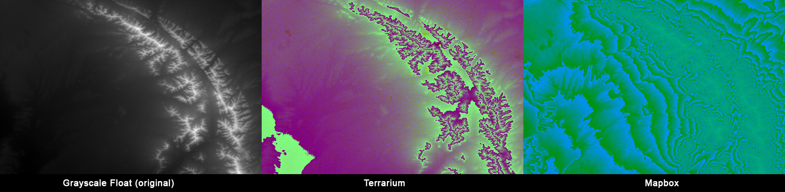

# dem2rgb
Convert multiples DEM/DTM images/tiles to geoserver optimized grayscale float DEMs, or Terrarium/Mapbox codification colors.

## Requeriments
- Python > 3
- numpy
- rasterio + GDAL

## Installation
- Download [GDAL](https://www.lfd.uci.edu/~gohlke/pythonlibs/#gdal), selecting the newest version of GDAL, and the appropriate one depending on the version of Python installed and the processor.If you are using Python 3.7, for example, download and then install using `pip install GDAL-3.3.1-cp37-cp37m-win_amd64.whl` (always adjusting according to the downloaded version).
- Download [Rasterio](https://www.lfd.uci.edu/~gohlke/pythonlibs/#rasterio), selecting the version analogous to GDAL, and install in the same way.
- To be able to use the installed package, configure environment variables (putting the full path depending on where the package is installed and the python version):
  - `GDAL_DATA`: '...\Python\Python37\Lib\site-packages\osgeo\data\gdal'
  - `PROJ_LIB`: '...\Python\Python37\Lib\site-packages\osgeo\data\proj'
  - Add to the `Path` variable the path '...\Python\Python37\Lib\site-packages\osgeo'
  - Check in console `gdalinfo --version`.
- Install the Numpy library using the `pip install numpy` command.

## Usage
- Run `python process.py --help` to display available options
- Run `python process.py --format terrarium|mapbox|grayscale` to convert all the images inside the default `input` folder to a custom format. By default, converted images are stored in the `output` folder